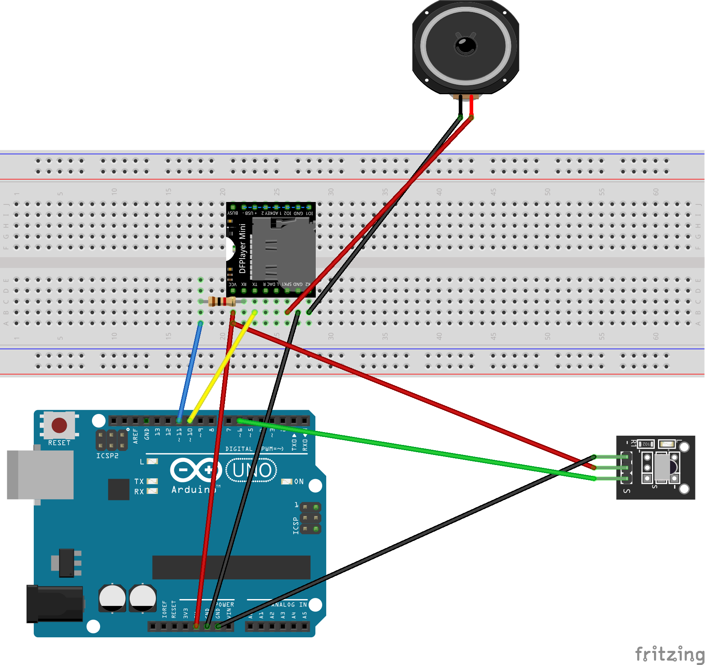

# mp3 player with IR remote

## Internet references

<https://wolles-elektronikkiste.de/dfplayer-mini-ansteuerung-mit-dem-arduino>

<https://github.com/DFRobot/DFRobotDFPlayerMini>

<https://github.com/Arduino-IRremote/Arduino-IRremote/>

## Fritzing

## Parts

- Arduino UNO R3
- MP3 Module: DFRobotDFPlayerMini
- Speaker
- Micro SD-Card
- IR Receiver (KY-022 or similar)
- IR Remote (the Elegoo IR remote from the Starter Kit for UNO was used for the codes in [KeyMap.h](KeyMap.h)
- 1 kOhm resistor

## Create MP3 files

- install nodejs
- install pico2wave
- install ffmpeg
- make mp3